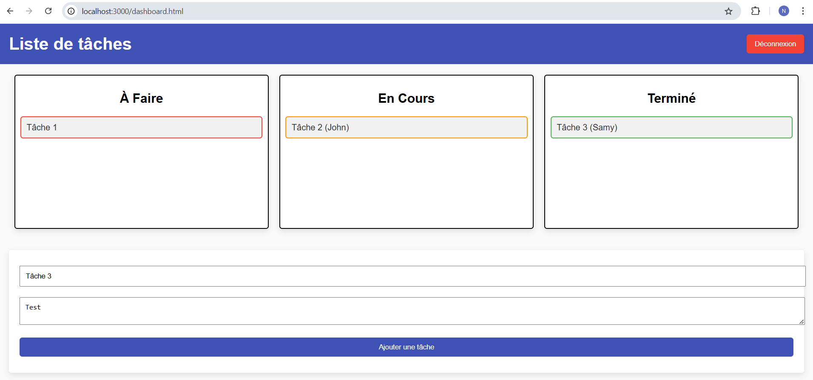

# Application

Le site créé est un site de liste de tâches, qui permet de créer des tâches, de savoir qui s'en occupe, de voir le status de ces denières si elles sont terminées ou non. Cela se fait à l'aide de connexion utilisateur.

# Installation
```
npm init -y
npm install express mysql body-parser cors
```

# Preview dashboard
# todolist-app
